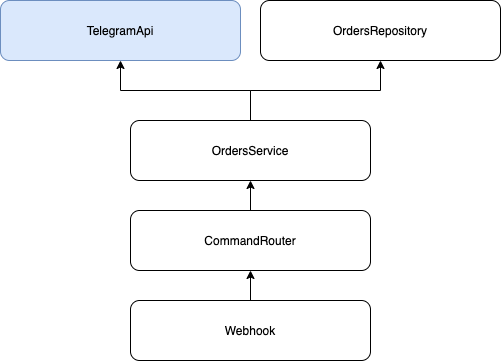

# NookBot

Telegram bot to manage order exchanges between members in a group

## Commands
 - /order - create an order that other members can take and deliver it to you.
 - /sent - marks order taken as delivered.
 - /list - lists all pending orders.

## Overview

The bot uses a Kotlin stack:
 - [Kotless](https://github.com/JetBrains/kotless/) - serverless framework
 - [DynamoDB](https://aws.amazon.com/dynamodb/) - persistence
 - [Kotlinx.serialization](https://github.com/Kotlin/kotlinx.serialization) - json serialization
 - [Ktor-client](https://ktor.io/clients/index.html) - http requests